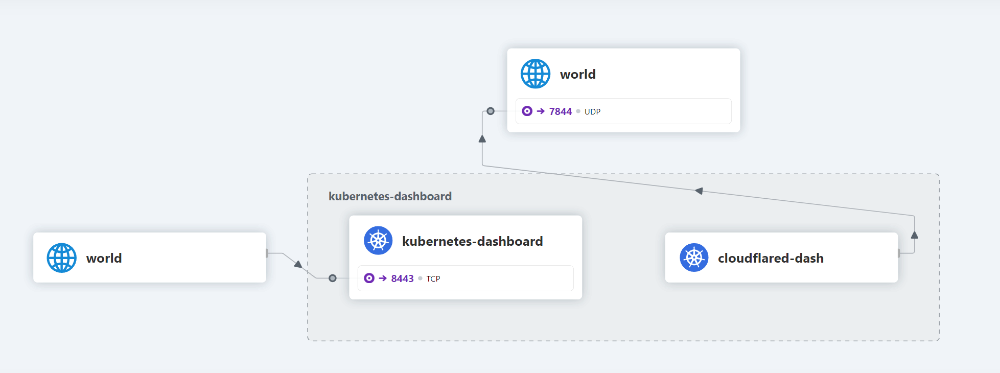

+++
title = 'Kubernetesを生やす (containerd)'
date = 2024-02-12T16:22:43+09:00
draft = false
categories = 'メモ'
author = "aki"
+++

# Kubernetesを生やす (containerd)

久々にやってみたくなったので

## 環境

- Ubuntu 22.04
- Kubernetes 1.28.2
- Cilium 1.15.0

### ネットワーク

| hostname     | ip           |
| ------------ | ------------ |
| k8s-master   | 192.168.1.80 |
| k8s-worker01 | 192.168.1.81 |

- コンテナは`10.200.0.0/16`とする

## 構築

### 更新する


すべてのNodeで実行する必要があります。


```bash
sudo apt update && sudo apt upgrade -y
```

### swapをしばく


すべてのNodeで実行する必要があります。


```bash
sudo swapoff -a
```

これは一時的なので`/etc/fstab`にあるswapファイルをコメントアウトして永続化する

```bash
sudo nano /etc/fstab
```

```diff
- /swap.img      none    swap    sw      0       0
+ #/swap.img      none    swap    sw      0       0
```

### ipフォワーディングの有効化


すべてのNodeで実行する必要があります。


```bash
# カーネルモジュール
cat <<EOF | sudo tee /etc/modules-load.d/k8s.conf
overlay
br_netfilter
EOF
sudo modprobe overlay
sudo modprobe br_netfilter
# カーネルパラメーター
cat <<EOF | sudo tee /etc/sysctl.d/k8s.conf
net.bridge.bridge-nf-call-iptables  = 1
net.bridge.bridge-nf-call-ip6tables = 1
net.ipv4.ip_forward                 = 1
EOF
sudo sysctl --system
```

### 確認する


すべてのNodeで実行する必要があります。


- カーネルモジュール

```bash
lsmod | grep br_netfilter
lsmod | grep overlay
```

```text
br_netfilter           32768  0
bridge                413696  1 br_netfilter
overlay               196608  18
```

3つの出力があることを確認する

- カーネルパラメーター

```bash
sysctl net.bridge.bridge-nf-call-iptables net.bridge.bridge-nf-call-ip6tables net.ipv4.ip_forward
```

```text
net.bridge.bridge-nf-call-iptables = 1
net.bridge.bridge-nf-call-ip6tables = 1
net.ipv4.ip_forward = 1
```

すべて1なことを確認する

- swapの無効化

```bash
free -h
```

```text
               total        used        free      shared  buff/cache   available
Mem:           7.7Gi       912Mi       4.2Gi       6.0Mi       2.6Gi       6.6Gi
Swap:             0B          0B          0B
```

swapの行がすべて0なことを確認する

### containerdを準備する


すべてのNodeで実行する必要があります。


なんか公式リポジトリのほうがdockerのリポジトリより新しいですが、今回はdockerリポジトリを使います。~~それで動いちゃったんだもん~~

- インストール

```bash
# 鍵
sudo install -m 0755 -d /etc/apt/keyrings
sudo curl -fsSL https://download.docker.com/linux/ubuntu/gpg -o /etc/apt/keyrings/docker.asc
sudo chmod a+r /etc/apt/keyrings/docker.asc
# リポジトリ
echo \
  "deb [arch=$(dpkg --print-architecture) signed-by=/etc/apt/keyrings/docker.asc] https://download.docker.com/linux/ubuntu \
  $(. /etc/os-release && echo "$VERSION_CODENAME") stable" | \
  sudo tee /etc/apt/sources.list.d/docker.list > /dev/null
sudo apt-get update
```

```bash
sudo apt install -y containerd.io
```

- コンフィグを生成して編集

```bash
containerd config default | sudo tee /etc/containerd/config.toml
sudo sed -i 's/SystemdCgroup = false/SystemdCgroup = true/g' /etc/containerd/config.toml
sudo sed -i 's#sandbox_image = "registry.k8s.io/pause:3.6"#sandbox_image = "registry.k8s.io/pause:3.9"#g' /etc/containerd/config.toml
sudo systemctl restart containerd && systemctl status containerd
```


絶対に`systemd_cgroup`を有効化しないこと！

このエラーが出て進まなくなります。
```text
[init] Using Kubernetes version: v1.26.1
[preflight] Running pre-flight checks
error execution phase preflight: [preflight] Some fatal errors occurred:
        [ERROR CRI]: container runtime is not running: output: time="2023-02-04T07:30:18Z" level=fatal msg="validate service connection: CRI v1 runtime API is not implemented for endpoint \"unix:///var/run/containerd/containerd.sock\": rpc error: code = Unimplemented desc = unknown service runtime.v1.RuntimeService"
, error: exit status 1
[preflight] If you know what you are doing, you can make a check non-fatal with `--ignore-preflight-errors=...`
To see the stack trace of this error execute with --v=5 or higher
```

消えてしまったのでエラー文は引用 <https://qiita.com/Kigou-No1/items/8fe68c826dc3dbe76fb4>


### kube* を準備する


すべてのNodeで実行する必要があります。


```bash
# 鍵
curl -fsSL https://packages.cloud.google.com/apt/doc/apt-key.gpg | sudo gpg --dearmor -o /etc/apt/keyrings/kubernetes-archive-keyring.gpg
# リポジトリ
echo "deb [signed-by=/etc/apt/keyrings/kubernetes-archive-keyring.gpg] https://apt.kubernetes.io/ kubernetes-xenial main" | sudo tee /etc/apt/sources.list.d/kubernetes.list
sudo apt-get update
```

```bash
sudo apt-get install -y kubeadm kubectl kubelet
```

自動的に更新されると厄介なのでcontainerdごとholdしておきます

```bash
sudo apt-mark hold kubeadm kubectl kubelet containerd.io
```

### コントロールプレーンを生やす


CPで実行する必要があります。


ここまで来たらやっと本体を作れます。昔masterって呼ばれてたやつですね。
ここでは長ったらしいので、`contro plane`の頭文字を取って`CP`と呼ぶことにします。

```bash
sudo kubeadm init --apiserver-advertise-address=192.168.1.80 --pod-network-cidr=10.200.0.0/16 --upload-certs
```

### workerを生やす


Workerで実行する必要があります。


好きなだけ生やしてください。
initしたときに出てきた下みたいなコマンドを実行するだけです。

```bash
sudo kubeadm join 192.168.1.80:6443 --token {token} \ 
    --discovery-token-ca-cert-hash sha256:{hash}
```

### Ciliumをインストールする


CPで実行する必要があります。


#### cliをインストール

```bash
CILIUM_CLI_VERSION=$(curl -s https://raw.githubusercontent.com/cilium/cilium-cli/main/stable.txt)
CLI_ARCH=amd64
if [ "$(uname -m)" = "aarch64" ]; then CLI_ARCH=arm64; fi
curl -L --fail --remote-name-all https://github.com/cilium/cilium-cli/releases/download/${CILIUM_CLI_VERSION}/cilium-linux-${CLI_ARCH}.tar.gz{,.sha256sum}
sha256sum --check cilium-linux-${CLI_ARCH}.tar.gz.sha256sum
sudo tar xzvfC cilium-linux-${CLI_ARCH}.tar.gz /usr/local/bin
rm cilium-linux-${CLI_ARCH}.tar.gz{,.sha256sum}
```

#### インストール



clangとllvmのインストールはすべてのNodeで実行する必要があります。


clangを入れておくこと！

無限にNotReadyで待つことになります。

```bash
sudo apt install -y clang
```



```bash
cilium install --version 1.15.0
```

<!-- ~~未検証ですが、wingetでcliを入れたwindowsからでもできるかも？~~ -->

### 環境構築ができたか確認する

```bash
kubectl get nodes
```

```text
NAME           STATUS   ROLES           AGE   VERSION
k8s-master     Ready    control-plane   14h   v1.28.2
k8s-worker01   Ready    <none>          14h   v1.28.2
```

```bash
cilium status
```

```text
    /¯¯\
 /¯¯\__/¯¯\    Cilium:             OK
 \__/¯¯\__/    Operator:           OK
 /¯¯\__/¯¯\    Envoy DaemonSet:    disabled (using embedded mode)
 \__/¯¯\__/    Hubble Relay:       disabled
    \__/       ClusterMesh:        disabled

Deployment             cilium-operator    Desired: 1, Ready: 1/1, Available: 1/1
DaemonSet              cilium             Desired: 2, Ready: 2/2, Available: 2/2
Containers:            cilium-operator    Running: 1
                       cilium             Running: 2
Cluster Pods:          2/2 managed by Cilium
Helm chart version:    1.14.6
Image versions         cilium             quay.io/cilium/cilium:v1.14.6@sha256:37a49f1abb333279a9b802ee8a21c61cde9dd9138b5ac55f77bdfca733ba852a: 2
                       cilium-operator    quay.io/cilium/operator-generic:v1.14.6@sha256:2f0bf8fb8362c7379f3bf95036b90ad5b67378ed05cd8eb0410c1afc13423848: 1
```

## 最後に

久々にやってみたけど、すごい手順が多くて大変だった。

自分の作ったk8sの中では多分一番まともだと思う

この後にストレージセットアップ([例](https://www.server-world.info/query?os=Ubuntu_20.04&p=kubernetes&f=5))の必要があったり、まだやることがある・・・

## 参照文献

- <https://zenn.dev/tochiman/articles/0cf100f428e81a>
- <https://zenn.dev/murasame29/articles/ee5868123c1e33>
- <https://qiita.com/ydclab_P002/items/0227a029d0bb236a126f>
- <https://docs.cilium.io/en/stable/gettingstarted/k8s-install-default/>

## おまけ

### ダッシュボードを動かす

```bash
kubectl apply -f https://raw.githubusercontent.com/kubernetes/dashboard/v2.7.0/aio/deploy/recommended.yaml
```

- dashboard-adminuser.yamlを作り、以下の内容を記載

```yaml
# from https://qiita.com/itoi10/items/e5b7d1ca2a588108d4b2
# Creating a Service Account
apiVersion: v1
kind: ServiceAccount
metadata:
  name: admin-user
  namespace: kubernetes-dashboard
---
# Creating a ClusterRoleBinding (管理者権限を付与)
apiVersion: rbac.authorization.k8s.io/v1
kind: ClusterRoleBinding
metadata:
  name: admin-user
roleRef:
  apiGroup: rbac.authorization.k8s.io
  kind: ClusterRole
  name: cluster-admin
subjects:
- kind: ServiceAccount
  name: admin-user
  namespace: kubernetes-dashboard
```

- トークンを取得する

```bash
kubectl -n kubernetes-dashboard create token admin-user
```

- 開きたいマシンでkubectlをセットアップして以下コマンドでproxy

```bash
kubectl proxy
```

#### コンテナ外の同じセグメントからアクセスできるように

- 以下のコマンドでコンフィグ編集を開始する

```bash
kubectl -n kubernetes-dashboard edit svc kubernetes-dashboard
```

- [ここ](https://sky-joker.tech/2019/04/21/kubernetes%E3%81%AE%E3%82%BF%E3%82%99%E3%83%83%E3%82%B7%E3%83%A5%E3%83%9B%E3%82%99%E3%83%BC%E3%83%88%E3%82%99%E3%82%92%E5%A4%96%E9%83%A8%E3%81%8B%E3%82%89%E3%82%A2%E3%82%AF%E3%82%BB%E3%82%B9%E3%81%99/)を参考に編集

### CiliumのHubbleを有効化

この画像のようなものが見れます



- 有効化

```bash
cilium hubble enable --ui
```

- 開きたいマシンで以下のコマンドを実行する

```bash
cilium hubble ui
```

windowsの場合は以下のコマンドでcliをインストール

```powershell
winget install Cilium.CiliumCLI
```

kubectlが動くようにセットアップしておく必要があります


